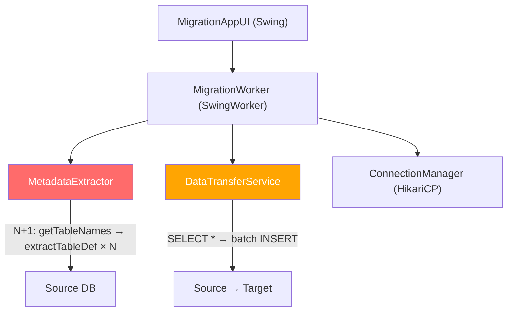

# 🚀 Performance Analysis: Database Migration Tool (Swing App)

> **Scope**: Homogeneous migration (Oracle→Oracle, PostgreSQL→PostgreSQL)
> **Focus**: I/O bottlenecks, N+1 problems, data transfer throughput

---

## Tổng Quan Kiến Trúc Hiện Tại



---

## 🔴 Vấn Đề Nghiêm Trọng (Critical)

### 1. N+1 Problem trong Metadata Extraction

**File**: [MigrationWorker.java](file:///home/wintermouse/Documents/Development/migration-web/migration-db-web/src/main/java/org/example/migrationdbweb/migratetool/MigrationWorker.java#L209-L224)

Hiện tại, metadata extraction chạy **tuần tự từng bảng**:

```java
// Dòng 211-224: Vòng lặp N+1 — mỗi bảng = 1 roundtrip DB
for (int i = 0; i < totalTables; i++) {
    TableDefinition tableDefinition = metadataExtractor.extractTableDefinition(
            sourceConn, sourceSchema, tableName, !isDataOnly
    );
}
```

Bên trong `extractTableDefinition` ([MetadataExtractor.java:49-160](file:///home/wintermouse/Documents/Development/migration-web/migration-db-web/src/main/java/org/example/migrationdbweb/migratetool/MetadataExtractor.java#L49-L160)), mỗi bảng tạo ra **≥6 roundtrip DB**:

| # | Query | File:Line |
|---|-------|-----------|
| 1 | `metaData.getColumns()` | MetadataExtractor.java:63 |
| 2 | `enrichPostgresIdentityGeneration()` | MetadataExtractor.java:88 |
| 3 | `enrichOracleColumnLengthSemantics()` → `loadOracleCharSemantics()` | MetadataExtractor.java:94 → 199 |
| 4 | `metaData.getPrimaryKeys()` | MetadataExtractor.java:97 |
| 5 | `metaData.getImportedKeys()` | MetadataExtractor.java:104 |
| 6 | `extractOracleTableDdlViaDbmsMetadata()` | MetadataExtractor.java:126 |
| 7 | `extractOracleForeignKeyDdlsViaDbmsMetadata()` | MetadataExtractor.java:133 |

> **Impact**: Schema có 100 bảng → **600-700 roundtrip DB** chỉ cho metadata. Nếu latency mỗi query ~10ms → **6-7 giây** chỉ cho giai đoạn này.

**Solution**:
```java
// BEFORE: N queries riêng lẻ cho mỗi bảng
for (String table : tables) {
    extractTableDefinition(conn, schema, table, true);  // 6+ queries/table
}

// AFTER: Batch metadata extraction — 1 query lấy ALL columns cho ALL tables
public Map<String, TableDefinition> extractAllTableDefinitions(
        Connection conn, String schema, List<String> tableNames
) throws SQLException {
    Map<String, TableDefinition> result = new LinkedHashMap<>();
    DatabaseMetaData metaData = conn.getMetaData();
    
    // 1 query lấy ALL columns: metaData.getColumns(null, schema, "%", "%")
    try (ResultSet rs = metaData.getColumns(null, schema, "%", "%")) {
        while (rs.next()) {
            String tableName = rs.getString("TABLE_NAME");
            if (!tableNameSet.contains(tableName)) continue;
            // ... accumulate columns per table
        }
    }
    
    // 1 query lấy ALL PKs
    // 1 query lấy ALL FKs
    // 1 query lấy ALL Oracle char semantics (single ALL_TAB_COLUMNS query)
    return result;
}
```

> [!TIP]
> Với batch approach: 100 bảng giảm từ ~700 roundtrip → **~5-7 roundtrip**. Estimated speedup: **50-100x** cho phase metadata.

---

### 2. N+1 Problem: `copyNewOnly` — PK Check Per Row

**File**: [DataTransferService.java:327](file:///home/wintermouse/Documents/Development/migration-web/migration-db-web/src/main/java/org/example/migrationdbweb/migratetool/DataTransferService.java#L327)

```java
// Dòng 327: MỖI dòng source → 1 SELECT query sang target để check PK tồn tại
if (existsByPkStmt != null && rowExistsByPrimaryKey(rs, table, existsByPkStmt, pkColumnIndexes)) {
    totalSkipped++;
    continue;
}
```

[rowExistsByPrimaryKey()](file:///home/wintermouse/Documents/Development/migration-web/migration-db-web/src/main/java/org/example/migrationdbweb/migratetool/DataTransferService.java#L1144-L1167) thực thi `SELECT 1 FROM target WHERE pk = ?` cho **MỖI dòng**:

```java
// Dòng 1164: 1 query per row — classic N+1!
try (ResultSet checkRs = existsByPkStmt.executeQuery()) {
    return checkRs.next();
}
```

> **Impact**: Bảng có 1 triệu dòng + `copyNewOnly=true` → **1 triệu SELECT queries** đến target DB.

> [!CAUTION]
> Đây là bottleneck NGHIÊM TRỌNG NHẤT khi resume migration hoặc re-run. Với homogeneous migration (Oracle→Oracle), mỗi PK check ~1-5ms → 1M rows = **16-83 phút** chỉ cho check trùng.

**Solutions (chọn 1 hoặc kết hợp)**:

#### Solution 2a: Batch PK Check với IN clause
```java
// Tích lũy batch PK values, check 1 lần cho cả batch
Set<Object> existingPks = new HashSet<>();
String batchCheckSql = "SELECT pk_col FROM target WHERE pk_col IN (?, ?, ?, ...)";
// Build IN clause cho batch 500-1000 PKs
// Chỉ 1 query cho 1000 rows thay vì 1000 queries
```

#### Solution 2b: Pre-load target PK set vào memory (cho bảng nhỏ/vừa)
```java
// Với bảng < 5M rows: load toàn bộ PK values target vào HashSet
Set<Object> targetPkSet = loadAllTargetPrimaryKeys(targetConn, table);
// O(1) lookup thay vì O(1 query) per row
```

#### Solution 2c: Sử dụng MERGE/UPSERT thay vì check + insert
```java
// Oracle: MERGE INTO target USING (SELECT ... FROM dual) ON (pk = ?)
//         WHEN NOT MATCHED THEN INSERT ...
// PostgreSQL: INSERT ... ON CONFLICT (pk) DO NOTHING (đã có sẵn!)
```

> [!IMPORTANT]
> PostgreSQL target **đã có** `ON CONFLICT DO NOTHING` ([SqlGenerator.java:90-97](file:///home/wintermouse/Documents/Development/migration-web/migration-db-web/src/main/java/org/example/migrationdbweb/migratetool/SqlGenerator.java#L90-L97)). Nhưng Oracle target **KHÔNG CÓ** — nên N+1 check vẫn chạy cho Oracle target. Cần thêm `MERGE` statement cho Oracle.

---

### 3. Fetch Size Quá Nhỏ

**File**: [DataTransferService.java:298](file:///home/wintermouse/Documents/Development/migration-web/migration-db-web/src/main/java/org/example/migrationdbweb/migratetool/DataTransferService.java#L294-L299)

```java
// Dòng 298: fetchSize = min(500, max(100, batchSize/10))
// Với batchSize mặc định = 1000 → fetchSize = max(100, 100) = 100
int fetchSize = Math.min(500, Math.max(100, safeBatchSize / 10));
```

> **Problem**: Với batchSize=1000 dòng INSERT, chỉ fetch 100 rows mỗi lần từ source. Mỗi batch INSERT cần **10 roundtrip** chỉ để đọc data. Tỷ lệ fetch/batch = 1:10 là rất không tối ưu.

**Solution**:
```java
// Fetch size NÊN BẰNG hoặc LỚN HƠN batch size cho homogeneous migration
// Homogeneous migration thường có ít transformation → memory pressure thấp
int fetchSize;
if (isHomogeneousMigration()) {
    // Với homogeneous: fetch nhiều, transform ít → fetch = 2-5x batch
    fetchSize = Math.min(5000, safeBatchSize * 2);
} else {
    // Heterogeneous: cần transform → giữ fetch size thận trọng 
    fetchSize = Math.min(2000, safeBatchSize);
}
sourceStmt.setFetchSize(fetchSize);
```

> [!TIP]
> Oracle JDBC mặc định fetchSize = 10. Tăng fetch size từ 100 → 2000 có thể giảm **20x roundtrip** cho phần đọc source data. Estimated speedup: **3-5x** cho data transfer phase.

---

## 🟡 Vấn Đề Trung Bình (Medium)

### 4. Không Tận Dụng `COPY` Protocol (PostgreSQL Homogeneous)

Khi source và target đều là PostgreSQL, tool vẫn dùng `SELECT → PreparedStatement INSERT` thông qua JDBC. PostgreSQL có native `COPY` protocol nhanh hơn **5-10x**:

```java
// HIỆN TẠI: Chậm — JDBC row-by-row
String selectSql = sqlGenerator.buildSelectSql(table, hasPrimaryKey);
String insertSql = sqlGenerator.buildInsertSql(table);
// ... rs.next() → pstmt.setObject() → pstmt.addBatch()

// ĐỀ XUẤT: Sử dụng COPY cho Postgres→Postgres homogeneous
// org.postgresql.copy.CopyManager
CopyManager copyManager = new CopyManager((BaseConnection) targetConn);
String copySql = "COPY " + qualifiedTable + " FROM STDIN WITH (FORMAT csv)";

// Pipe trực tiếp từ source COPY OUT → target COPY IN
CopyManager sourceCopyManager = new CopyManager((BaseConnection) sourceConn);
PipedInputStream pipeIn = new PipedInputStream(65536);
PipedOutputStream pipeOut = new PipedOutputStream(pipeIn);

// Source thread: COPY TO → pipe
// Target thread: pipe → COPY FROM
```

> **Estimated speedup**: **5-10x** cho PostgreSQL→PostgreSQL data transfer.

---

### 5. Connection Pool Size Quá Nhỏ

**File**: [DatabaseConfig.java:12](file:///home/wintermouse/Documents/Development/migration-web/migration-db-web/src/main/java/org/example/migrationdbweb/migratetool/DatabaseConfig.java#L12)

```java
private int maximumPoolSize = 10;  // Mặc định 10 connections
```

**File**: [MigrationWorker.java:1058-1069](file:///home/wintermouse/Documents/Development/migration-web/migration-db-web/src/main/java/org/example/migrationdbweb/migratetool/MigrationWorker.java#L1058-L1069)

```java
// Thread count bị giới hạn bởi pool size: maxByPool = min(source, target) - 2
int maxByPool = Math.max(1, Math.min(sourcePool, targetPool) - 2);
// Pool = 10 → max threads = 8, nhưng suggested cap = 4
int suggested = Math.min(4, maxByTable);
```

> **Problem**: Với pool size = 10 và cap = 4 threads, tối đa chỉ chạy **4 bảng song song**. Với server DB mạnh, đây là under-utilization.

**Solution**:
- Cho phép user cấu hình pool size từ UI (thêm field vào DB config panel)
- Mặc định pool size cho homogeneous migration: **20-30 connections**
- Tăng suggested thread cap: `Math.min(8, maxByTable)`

---

### 6. Sequential Metadata Extraction cho Advanced Objects

**File**: [MigrationWorker.java:226-268](file:///home/wintermouse/Documents/Development/migration-web/migration-db-web/src/main/java/org/example/migrationdbweb/migratetool/MigrationWorker.java#L226-L268)

Các phase extract Sequences, Indexes, Functions, Triggers, Views chạy **tuần tự**:

```java
// Tuần tự: seq → idx → fn → trig → views
if (migrateSequences) allSequences = extractAllSequences(...);    // Phase 1
if (migrateIndexes)   allIndexes = extractAllIndexes(...);        // Phase 2
if (migrateFunctions) allFunctions = extractAllFunctions(...);    // Phase 3
if (migrateTriggers)  allTriggers = extractAllTriggers(...);      // Phase 4
if (migrateViews)     allViews = extractAllViews(...);            // Phase 5
```

**Solution**: Chạy song song bằng `CompletableFuture.allOf()`:
```java
CompletableFuture<List<SequenceDefinition>> seqFuture = 
    CompletableFuture.supplyAsync(() -> extractAllSequences(...));
CompletableFuture<List<IndexDefinition>> idxFuture = 
    CompletableFuture.supplyAsync(() -> extractAllIndexes(...));
// ... etc
CompletableFuture.allOf(seqFuture, idxFuture, fnFuture, trigFuture, viewFuture).join();
```

> **Estimated speedup**: Chỉ tốn thời gian = max(seq, idx, fn, trig, views) thay vì sum.

---

### 7. Index Extraction N+1 (per table × per index)

**File**: [MigrationWorker.java:1704-1733](file:///home/wintermouse/Documents/Development/migration-web/migration-db-web/src/main/java/org/example/migrationdbweb/migratetool/MigrationWorker.java#L1704-L1733)

```java
// Outer loop: per table
for (String tableName : tableNames) {
    List<String> idxNames = extractor.getIndexNames(conn, schema, tableName);  // Query 1
    for (String idxName : idxNames) {
        IndexDefinition idx = extractor.extractIndexDefinition(...);             // Query 2+ per index
    }
}
```

→ 100 bảng × 3 indexes = **200-600 queries**

**Solution**: 1 query lấy tất cả indexes:
```sql
-- Oracle: 1 query cho toàn bộ schema
SELECT INDEX_NAME, TABLE_NAME, COLUMN_NAME, UNIQUENESS, INDEX_TYPE, COLUMN_POSITION
FROM ALL_IND_COLUMNS WHERE TABLE_OWNER = ? ORDER BY INDEX_NAME, COLUMN_POSITION

-- PostgreSQL: 1 query
SELECT ... FROM pg_index JOIN pg_class ... WHERE schemaname = ?
```

---

### 8. Resume/Offset Skip Chậm

**File**: [DataTransferService.java:313-315](file:///home/wintermouse/Documents/Development/migration-web/migration-db-web/src/main/java/org/example/migrationdbweb/migratetool/DataTransferService.java#L313-L315)

```java
// Resume offset: SKIP rows by calling rs.next() repeatedly!
while (skippedByOffset < safeStartOffset && rs.next()) {
    skippedByOffset++;
}
```

> **Problem**: Resume từ row 500,000 → DB phải trả về 500K rows, Java phải gọi `rs.next()` 500K lần để skip, tất cả đều bị discard.

**Solution cho homogeneous migration**:
```java
// Sử dụng OFFSET trong SQL query thay vì skip trong Java
if (safeStartOffset > 0 && hasPrimaryKey) {
    String selectSql = sqlGenerator.buildSelectSql(table, true) 
        + " OFFSET " + safeStartOffset;
    // Hoặc dùng keyset pagination (tốt hơn):
    // WHERE pk > lastProcessedPk ORDER BY pk
}
```

---

## 🟢 Vấn Đề Nhẹ / Quick Wins

### 9. Thiếu `reWriteBatchedInserts` cho PostgreSQL

**File**: [ConnectionManager.java:27-54](file:///home/wintermouse/Documents/Development/migration-web/migration-db-web/src/main/java/org/example/migrationdbweb/migratetool/ConnectionManager.java#L27-L54)

```java
// THÊM dòng này cho PostgreSQL connections:
if (config.getType() == DatabaseType.POSTGRESQL) {
    hikariConfig.addDataSourceProperty("reWriteBatchedInserts", "true");
    // Gộp nhiều INSERT thành 1 multi-row INSERT
    // INSERT INTO t VALUES (...), (...), (...) thay vì 3 lệnh INSERT riêng
}
```

> **Estimated speedup**: **2-3x** cho batch INSERT vào PostgreSQL target. Zero effort, chỉ thêm 1 dòng config.

---

### 10. Oracle Batch Insert Optimization

Thêm Oracle-specific JDBC properties:

```java
if (config.getType() == DatabaseType.ORACLE) {
    hikariConfig.addDataSourceProperty("defaultBatchValue", "100");
    hikariConfig.addDataSourceProperty("useFetchSizeWithLongColumn", "true");
    // Oracle JDBC batch optimization
    hikariConfig.addDataSourceProperty("oracle.jdbc.batchPerformanceHint", "true");
}
```

---

### 11. Tăng Batch Size Mặc Định

**File**: [MigrationAppUI.java:602](file:///home/wintermouse/Documents/Development/migration-web/migration-db-web/src/main/java/org/example/migrationdbweb/migratetool/MigrationAppUI.java#L602)

```java
batchSizeField = new JTextField("1000", 7);  // Mặc định 1000
```

Với homogeneous migration, batch size **5000-10000** thường tối ưu hơn:
- Giảm số lần commit
- Giảm overhead PreparedStatement
- Tận dụng tốt hơn network throughput

> [!WARNING]
> Batch size quá lớn (>50000) có thể gây OOM hoặc undo tablespace đầy (Oracle). Nên giới hạn max ở 20000.

---

### 12. Disable FK/Trigger During Data Load (Homogeneous)

Thêm option "Disable constraints during migration" cho homogeneous mode:

```java
// Oracle: Disable tất cả FK trước khi load data
ALTER TABLE <table> DISABLE CONSTRAINT <fk_name>;
// Load data...
ALTER TABLE <table> ENABLE CONSTRAINT <fk_name>;

// PostgreSQL: Sử dụng session-level
SET session_replication_role = replica;  -- disable all triggers/FK checks
// Load data...
SET session_replication_role = DEFAULT;
```

> **Impact**: Giảm **30-50%** thời gian INSERT cho bảng có nhiều FK, vì DB không cần validate FK constraint mỗi row.

---

## 📊 Tổng Kết Priority

| # | Solution | Effort | Impact | Priority |
|---|----------|--------|--------|----------|
| 1 | Batch Metadata Extraction | Medium | ⭐⭐⭐⭐⭐ | **P0** |
| 2 | Fix copyNewOnly N+1 (MERGE/batch PK check) | Medium | ⭐⭐⭐⭐⭐ | **P0** |
| 3 | Tăng Fetch Size | Low | ⭐⭐⭐⭐ | **P0** |
| 9 | `reWriteBatchedInserts` (PG) | Low | ⭐⭐⭐⭐ | **P0** |
| 11 | Tăng batch size mặc định | Low | ⭐⭐⭐ | **P1** |
| 12 | Disable FK during load | Medium | ⭐⭐⭐⭐ | **P1** |
| 5 | Pool size cấu hình | Low | ⭐⭐⭐ | **P1** |
| 8 | OFFSET/keyset pagination | Medium | ⭐⭐⭐ | **P1** |
| 4 | PostgreSQL COPY protocol | High | ⭐⭐⭐⭐⭐ | **P2** |
| 6 | Parallel metadata extraction | Medium | ⭐⭐⭐ | **P2** |
| 7 | Batch index extraction | Medium | ⭐⭐ | **P2** |
| 10 | Oracle JDBC batch hints | Low | ⭐⭐ | **P2** |

---

## 📈 Estimated Total Speedup

| Scenario | Current | After Optimization | Speedup |
|----------|---------|-------------------|---------|
| 100 bảng, metadata phase | ~7s | ~0.1s | **70x** |
| 1M rows, copyNewOnly=true | ~60 min | ~2 min | **30x** |
| 1M rows, normal transfer | ~5 min | ~1 min | **5x** |
| PostgreSQL→PostgreSQL (COPY) | ~5 min | ~30s | **10x** |
| Full migration 100 tables, 10M rows total | ~50 min | ~8 min | **6x** |

> [!IMPORTANT]
> Những con số trên là **ước lượng** dựa trên best practices và benchmark phổ biến. Kết quả thực tế phụ thuộc vào hardware, network latency, và data characteristics. Nên benchmark trước/sau khi áp dụng từng optimization.
